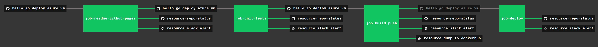

# CONCOURSE CONTINUOUS INTEGRATION & DEPLOYMENT

I use concourse to automate,

* Use README for
  [GitHub Webpage](https://jeffdecola.github.io/hello-go-deploy-azure-vm/)
* TEST code
* BUILD docker image
* PUSH to dockerhub
* DEPLOY to azure vm
* Alert me of the progress via repo status and slack

## PIPELINE

The concourse
[pipeline.yml](https://github.com/JeffDeCola/hello-go-deploy-azure-vm/blob/master/ci/pipeline.yml)
shows the entire ci flow,

## JOBS, TASKS AND RESOURCE TYPES

Concourse Jobs and Tasks

* `job-readme-github-pages` runs task
  [task-readme-github-pages.yml](https://github.com/JeffDeCola/hello-go-deploy-azure-vm/blob/master/ci/tasks/task-readme-github-pages.yml)
  that kicks off shell script
  [readme-github-pages.sh](https://github.com/JeffDeCola/hello-go-deploy-azure-vm/blob/master/ci/scripts/readme-github-pages.sh)
* `job-unit-tests` runs task
  [task-unit-tests.yml](https://github.com/JeffDeCola/hello-go-deploy-azure-vm/blob/master/ci/tasks/task-unit-tests.yml)
  that kicks off shell script
  [unit-tests.sh](https://github.com/JeffDeCola/hello-go-deploy-azure-vm/tree/master/ci/scripts/unit-tests.sh)
* `job-build-push` runs task
  [task-build-push.yml](https://github.com/JeffDeCola/hello-go-deploy-azure-vm/blob/master/ci/tasks/task-build-push.yml)
  that kicks off shell script
  [build-push.sh](https://github.com/JeffDeCola/hello-go-deploy-azure-vm/tree/master/ci/scripts/build-push.sh)
* `job-deploy` runs task
  [task-deploy.yml](https://github.com/JeffDeCola/hello-go-deploy-azure-vm/blob/master/ci/tasks/task-deploy.yml)
  that kicks off shell script
  [deploy.sh](https://github.com/JeffDeCola/hello-go-deploy-azure-vm/tree/master/ci/scripts/deploy.sh)

Concourse Resources

* `hello-go-deploy-azure-vm` uses a resource type
  [docker image](https://hub.docker.com/r/concourse/git-resource/)
  to PULL a repo from github
* `resource-dump-to-dockerhub` uses a resource type
  [docker image](https://hub.docker.com/r/concourse/docker-image-resource/)
  to PUSH a docker image to dockerhub
* `resource-slack-alert` uses a resource type
  [docker image](https://hub.docker.com/r/cfcommunity/slack-notification-resource)
  that will notify slack on your progress
* `resource-repo-status` uses a resource type
  [docker image](https://hub.docker.com/r/jeffdecola/github-status-resource-clone)
  that will update your git status for that particular commit
